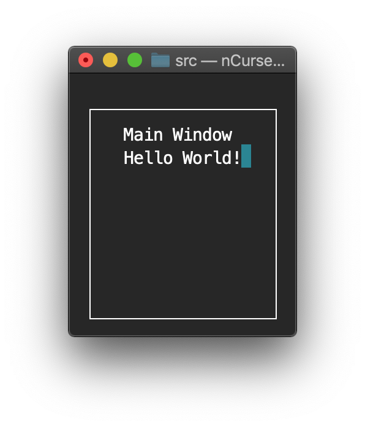
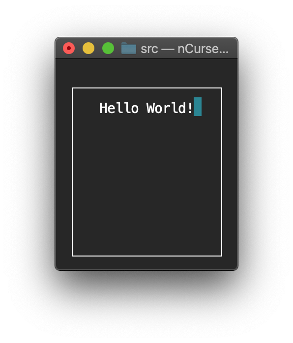
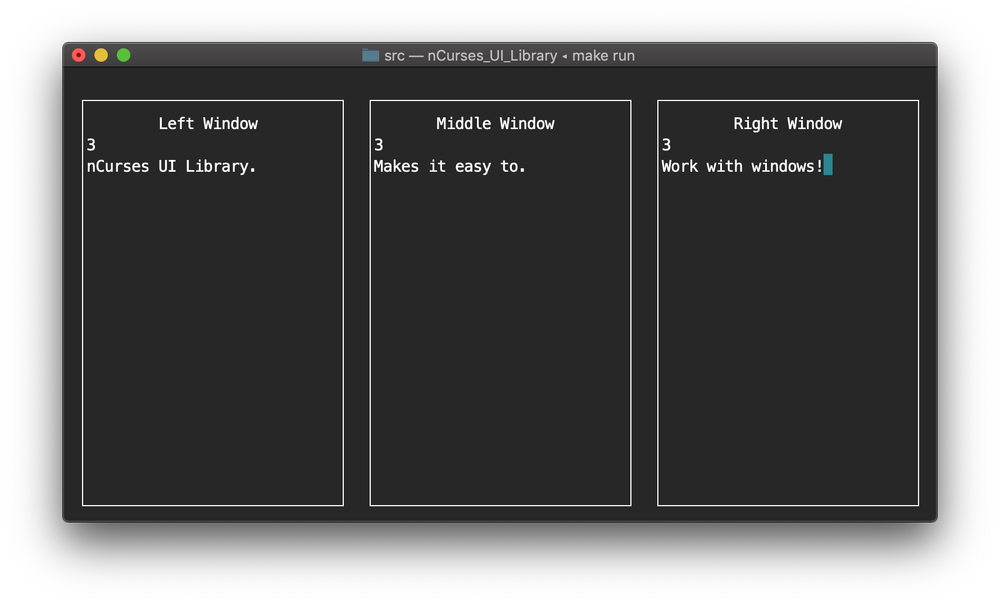

#  nCurses UI Library

## Description
- This UI library aims to make it easy to construct and use windows within the
  command line.  The library uses ncurses under the hood, so that must be
  installed on your system.  This library was only tested on a macOS machine;
  there is no guarantee runs correctly, or even at all, on any other machines.

## Background
- Where this came from
- Why files are separated how they are
...

## UI Methods Explained
-
-
-
...

## How to Use

### Small Example: Titled Window:

This example shows how simple it is to make a titled window with centered text.

```C++
#include "UI.hpp"

int main()
{
    UI ui;
    ui.make_new_window (1, 1, 30, 20, "Main Window", true);
    ui.write_to_window (0, "Hello World!", false);
    getch();
}

```



### Small Example: Non-Titled Window:

Of course, our windows do not have to have titles at all.  We can omit them and
use the extra line as printable space.  All we have to do pass an empty string
into the `make_new_window()` function and the window will not display a title

```C++
...
ui.make_new_window (1, 1, 30, 20, "", true);
...

```



This example illustrates how to create multiple titled windows and how to allow
for live input.  Using `const int`s makes it easy to keep all windows uniform
and allows for quickly changing all windows at once.  Using an `enum` makes
remembering which window is which simple.

### Large Example:

```C++
#include "UI.hpp"

int main()
{
    // Declare UI object
    UI ui;

    // Helper ints to make changing this particular UI configuration simple
    const unsigned int x = 1;
    const unsigned int y = 1;
    const unsigned int width = 30;
    const unsigned int height = 20;
    const unsigned int x_window_distance = 2;

    // Make windows
    // Note: window creation is a dynamic procedure
    ui.make_new_window (x + (0 * (x_window_distance + width)), y, width, height, "Left Window", false);
    ui.make_new_window (x + (1 * (x_window_distance + width)), y, width, height, "Middle Window", true);
    ui.make_new_window (x + (2 * (x_window_distance + width)), y, width, height, "Right Window", false);

    // Enumerations to make remembering a window easier
    enum windows
    {
        left,
        middle,
        right,
    };

    ui.write_to_all_windows (std::to_string (ui.get_number_of_windows()), true);

    // Random character used to break input loops
    const char input_break = '[';

    // Live input into each of the windows
    while (ui.live_input (left,   false) != input_break);
    while (ui.live_input (middle, false) != input_break);
    while (ui.live_input (right,  false) != input_break);
}
```



An example makefile for the previous examples

```makefile
BIN_NAME = nCurses_UI_Library_Test
LIBRARIES = -lncurses
OBJECT_FILES = main.o UI.o Window.o Write.o
CXXFLAGS = -std=c++17

$(BIN_NAME): $(OBJECT_FILES)
	g++ -o $(BIN_NAME) $(OBJECT_FILES) $(LIBRARIES)

main.o: main.cpp
	g++ $(CXXFLAGS) -c main.cpp

UI.o: UI.cpp UI.hpp Window.hpp
	g++ $(CXXFLAGS) -c UI.cpp

Window.o: Window.cpp Window.hpp Write.hpp
	g++ $(CXXFLAGS) -c Window.cpp

Write.o: Write.cpp Write.hpp
	g++ $(CXXFLAGS) -c Write.cpp

clean:
	rm -rf *.o
	rm -rf *.out
	rm -rf *~
	rm $(BIN_NAME)

run:
	./$(BIN_NAME)
```
